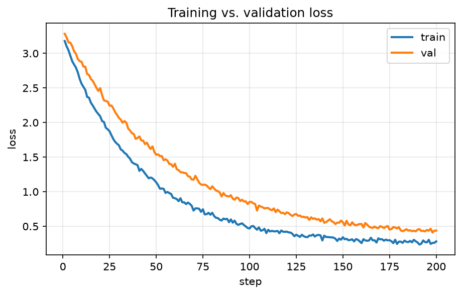

# Embedding plots from a notebook

This post shows the two ways to include a plot generated by
[`notebooks/example_plots.ipynb`](https://github.com/YOUR_USERNAME/YOUR_USERNAME.github.io/blob/main/notebooks/example_plots.ipynb):
a **static image** and a **fully interactive chart**. Both are produced by running
the notebook, which writes files into `docs/assets/plots/`.

<!-- more -->

## 1. Static image (matplotlib → PNG)

Best when you want something lightweight that always renders — even in the RSS
feed or on GitHub. Just reference the generated PNG with normal Markdown:

{ .plot }

```markdown
{ .plot }
```

## 2. Interactive chart (Plotly → inlined HTML)

The notebook exports a self-contained Plotly fragment to
`docs/assets/plots/scaling.html`. We inline it here with a snippet include, so the
chart is **hover-, zoom-, and pan-able** right in the page:

--8<-- "assets/plots/scaling.html"

The one line that embeds it:

```markdown
--8<-- "assets/plots/scaling.html"
```

!!! tip "Regenerating the plots"
    Run `make plots` (or `uv run jupyter nbconvert --to notebook --execute
    --inplace notebooks/example_plots.ipynb`). The committed HTML/PNG are what the
    site serves, so the deploy never needs to execute your notebook.
